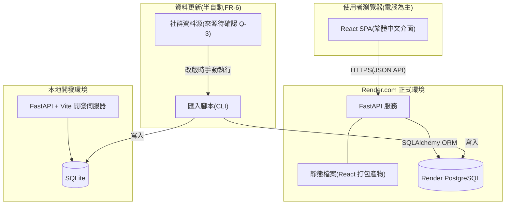
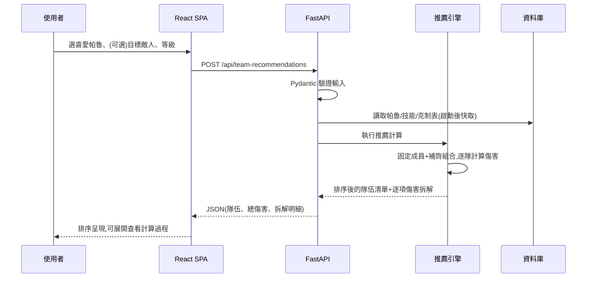
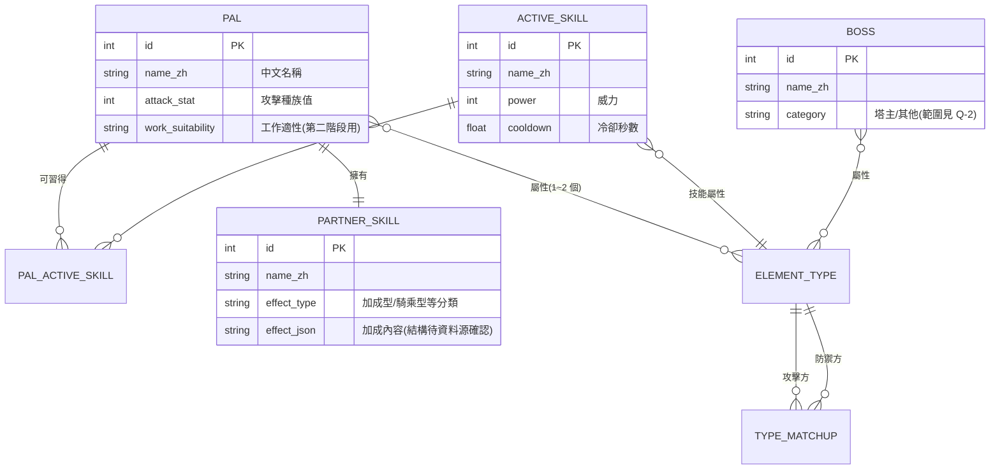

# 架構設計文件:幻獸帕魯隊伍與打工最佳化系統

> 建立日期:2026-07-16
> 依據:doc/requirements.md(2026-07-16 定稿版)
> 狀態:草稿(Draft)

## 1. 系統架構

整體採**前後端分離的單體式(Monolith)架構**:React 單頁應用(SPA)作為介面,FastAPI 提供計算與資料 API,資料庫存放帕魯靜態資料。選擇單體式而非微服務的理由:使用者只有本人與朋友(需求第 3 節),流量極小,單一服務最容易開發、部署與除錯,也最省 Render.com 費用。

部署採**單一服務**模式:FastAPI 同時提供 API 與 React 打包後的靜態檔案。這樣只需維護一個 Render 服務、一個網址,且前後端同源、不需處理 CORS,對應「朋友透過網址直接使用」的驗收條件。

## 2. 核心模組職責

| 模組 | 職責 | 對應需求 |
|------|------|----------|
| 前端:帕魯選擇 | 搜尋、瀏覽全帕魯,選擇喜愛帕魯作為隊伍固定成員 | FR-2 |
| 前端:條件設定 | 選擇目標敵人(頭目或屬性組合,可不選)與計算等級 | FR-3、已確認決策(等級) |
| 前端:結果呈現 | 依傷害排序顯示推薦隊伍,每隊可展開傷害拆解明細;帕魯以純文字名稱+屬性色塊呈現,不使用遊戲圖片(2026-07-16 已確認,避免版權疑慮) | FR-4、FR-5 |
| 後端:帕魯資料 API | 提供帕魯、技能、頭目、屬性克制表的查詢 | FR-1、FR-2、FR-3 |
| 後端:隊伍推薦引擎 | 以固定成員為中心,從全帕魯補齊隊員,計算並排序最大傷害組合 | FR-4 |
| 後端:傷害計算器 | 單一帕魯對目標的傷害計算(克制倍率、種族值、主動技能、加成型夥伴技能、等級換算);推薦引擎的基礎元件 | FR-4、FR-5 |
| 資料匯入腳本(CLI) | 從社群資料源解析帕魯資料,驗證後寫入資料庫;改版時手動執行 | FR-6 |
| (預留)打工配置引擎 | 第二階段功能,本版僅預留模組位置,不設計細節(Q-7) | FR-7 |

**傷害計算器獨立成模組**的理由:它同時服務「推薦排序」與「透明化拆解」兩個需求(FR-4、FR-5)——同一份計算邏輯既產生排序分數,也輸出逐項明細,保證使用者看到的拆解與排序依據完全一致,不會有兩套算法對不上的問題。

## 3. 資料流

主要情境:使用者取得隊伍推薦。

- 帕魯資料為**唯讀靜態資料**(只有匯入腳本會寫入),因此 API 啟動後可將全部帕魯資料快取於記憶體,推薦計算不需逐次查詢資料庫,確保「數秒內顯示結果」的驗收條件。
- 推薦引擎的組合空間:固定成員 k 隻、從約 200 隻補齊至 5 隻。因加成型夥伴技能會影響全隊,無法單純逐隻排名;實作時需以剪枝或啟發式(如先依單體傷害取前 N 名再組合)控制計算量。具體演算法依 Q-6 傷害公式確認後於開發時定案。

## 4. 資料庫設計建議

**資料庫類型**:關聯式資料庫(本地 SQLite、正式 Render PostgreSQL,專案既定)。帕魯、技能、屬性之間是結構清楚的多對多關聯,關聯式模型最合適。一律透過 SQLAlchemy ORM 存取並以 Alembic 管理遷移,避免兩種資料庫的語法差異。

主要資料實體(細節由後續 data-model 文件定義):

設計要點:

- `PARTNER_SKILL.effect_type` 用於區分「編隊即生效的加成型」與「騎乘型」等——已確認決策只計算加成型,分類欄位讓計算器能過濾。
- `TYPE_MATCHUP` 為屬性克制倍率表(攻擊屬性 × 防禦屬性 → 倍率),資料量小但為計算核心。
- 工作適性欄位在第一版即隨匯入腳本一併存入(資料源本來就有),第二階段打工配置不需重新匯資料。
- 全部資料為匯入腳本產生的靜態資料,無使用者產生內容(無會員系統),因此不需要 users 相關資料表。

## 5. API 設計建議

**風格**:REST + JSON。理由:端點少、語意單純(查資料+一個計算請求),REST 最直觀;GraphQL 對這個規模是過度設計。全部端點掛在 `/api` 前綴下,其餘路徑交給靜態檔案服務。

| 方法 | 路徑 | 用途 | 對應需求 |
|------|------|------|----------|
| GET | `/api/pals?search=&element=` | 帕魯清單(搜尋/篩選) | FR-2 |
| GET | `/api/pals/{id}` | 單隻帕魯詳情(技能、夥伴技能) | FR-2、FR-5 |
| GET | `/api/bosses` | 頭目清單 | FR-3 |
| GET | `/api/elements` | 屬性清單與克制倍率表 | FR-3、FR-5 |
| POST | `/api/team-recommendations` | 輸入固定成員、目標(可選)、等級,回傳排序後的推薦隊伍與傷害拆解 | FR-4、FR-5 |
| GET | `/api/health` | 健康檢查(Render 監控用) | — |

慣例:

- 回應格式統一 `{ "data": ..., "meta": ... }`;錯誤統一 `{ "error": { "code": ..., "message": ... } }`,message 為繁體中文
- 輸入驗證由 Pydantic schema 承擔:固定成員數量上限(隊伍上限,見 Q-1)、等級範圍(見 Q-4b)、頭目與屬性擇一
- 推薦計算為同步請求-回應。若實測計算超過數秒,再考慮改非同步任務——先不預作複雜設計

## 6. 技術選型

| 層面 | 建議方案 | 理由 | 替代方案 |
|------|----------|------|----------|
| 後端框架 | FastAPI(專案既定) | 既定決策;Pydantic 驗證與自動 API 文件對開發除錯友善 | — |
| 前端框架 | React + Vite(建置工具) | React 為既定決策;Vite 啟動快、設定少,對初學者友善 | Create React App(已停止維護,不建議) |
| ORM/遷移 | SQLAlchemy 2.x + Alembic | 同一套程式碼跑 SQLite 與 PostgreSQL;Alembic 管理 schema 演進 | — |
| 前端資料請求 | TanStack Query(React Query) | 快取、載入/錯誤狀態管理現成,減少自己寫的狀態邏輯 | 純 fetch + useState(端點少也可行,但載入/錯誤處理要自己寫) |
| UI 樣式 | Tailwind CSS | 不需設計系統即可快速做出整齊介面;純工具類別對 AI 代理生成友善 | MUI(元件現成但客製較繁) |
| 伺服器 | uvicorn | FastAPI 標準搭配 | — |
| 資料匯入 | Python CLI 腳本(隨後端程式庫) | 與後端共用 ORM 模型,驗證邏輯一致 | — |

## 7. 安全性

本系統無會員、無使用者資料,攻擊面主要在公開 API 與機密管理:

- **機密管理**:資料庫連線字串等一律環境變數注入(本地 `.env`、正式 Render 環境變數後台),遵循 AGENTS.md 規範(禁止硬編碼、`.env` 入 `.gitignore`、維護 `.env.example`)
- **輸入驗證**:所有 API 輸入經 Pydantic 驗證(型別、範圍、數量上限);ORM 參數化查詢防 SQL 注入
- **錯誤處理**:正式環境的 500 錯誤回傳通用訊息,不洩漏堆疊與內部路徑
- **無認證設計的界線**:API 為唯讀查詢+無副作用的計算,公開可接受;**資料匯入不做成公開 API 端點**,僅以 CLI 執行(本地寫 SQLite;正式環境透過 Render 的一次性任務或本機連線執行),避免公開的寫入路徑
- **基本濫用防護**:推薦計算端點為 CPU 密集,建議加簡單的速率限制(如 slowapi),防止被打爆(優先級低,朋友圈使用場景風險有限)

## 8. 部署方式

- **正式環境**:Render.com 單一 Web Service。建置流程:先 `npm run build` 產出 React 靜態檔,FastAPI 以 `StaticFiles` 服務之;uvicorn 啟動。資料庫用 Render PostgreSQL(連線字串由 Render 環境變數 `DATABASE_URL` 注入)
- **CI/CD**:連接 GitHub repository,推送 main 分支自動部署(Render 內建);部署前於 build script 執行 Alembic 遷移
- **環境區分**:本地開發(SQLite + Vite dev server + FastAPI reload)/ 正式(Render + PostgreSQL)。以 `DATABASE_URL` 環境變數切換,程式碼零修改
- **初始資料**:首次部署後執行匯入腳本灌入帕魯資料;改版更新同一流程
- **監控與日誌**:Render 內建日誌與 `/api/health` 健康檢查即可,規模不需要額外監控系統
- **費用方案**:採用 Render **免費層**(2026-07-16 已確認)。閒置休眠後首次喚醒需數十秒,使用者已接受此限制;「數秒出結果」的驗收條件適用於服務喚醒後的正常使用狀態

## 9. 待確認事項

| 編號 | 事項 | 影響的設計決策 | 建議選項 |
|------|------|----------------|----------|
| Q-1 | 隊伍人數上限是否固定 5 隻(承需求 Q-1) | API 輸入驗證上限、推薦引擎組合數 | 固定 5,做成設定值方便日後調整 |
| Q-2 | 頭目清單初版收錄範圍(承需求 Q-2) | BOSS 資料表內容、匯入腳本範圍 | 初版先塔主,之後擴充 |
| Q-3 | 資料來源選定(承需求 Q-3) | 匯入腳本的解析格式、PARTNER_SKILL.effect_json 結構 | 優先評估 GitHub 社群 JSON 資料集(格式穩定、可版控) |
| Q-4b | 等級選單預設值與範圍(承需求 Q-4b) | 前端等級選擇元件、API 驗證範圍 | **已結案(2026-07-18)**:範圍 1~80、預設 80(遊戲 1.0 上限;大絕於 70 級習得,上限須 ≥ 70) |
| Q-6 | 傷害公式版本(承需求 Q-6) | 傷害計算器核心邏輯、推薦引擎剪枝策略 | 開發前以社群考據文件定案,公式版本記入 project-memory |
| Q-7 | 打工配置需求細節(承需求 Q-7) | 打工配置引擎設計(本版僅預留) | 第二階段開發前補訪談 |

> 已結案(2026-07-16 使用者確認):Q-A1(第一版不使用遊戲圖片,帕魯以純文字名稱+屬性色塊呈現)、Q-A2(採用 Render 免費層,接受閒置喚醒延遲)。決策已併入第 2 節與第 8 節。
> 已結案(2026-07-16,T-2/T-3 完成):Q-3(資料來源:blaynem/paldex zh-Hant,已入 backend/data/source/)、Q-6(傷害公式社群共識版,完整規格見 project-memory)。
