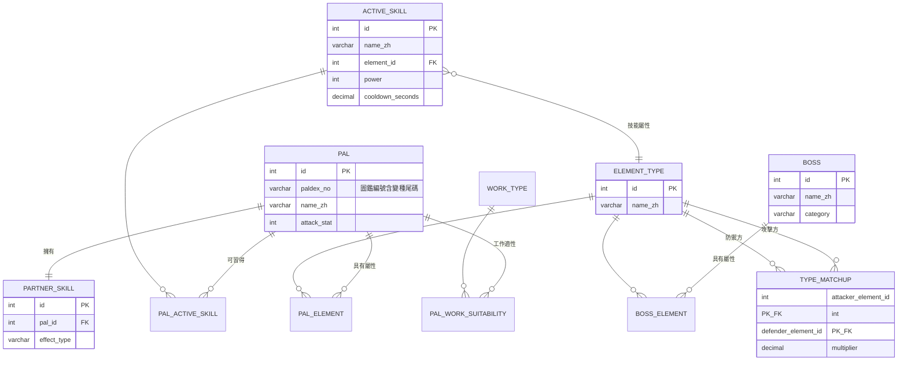

# 資料模型文件:幻獸帕魯隊伍與打工最佳化系統

> 建立日期:2026-07-16
> 依據:doc/requirements.md、doc/architecture.md(均為 2026-07-16 定稿版)
> 狀態:草稿(Draft)

本系統的資料全部為**匯入腳本產生的唯讀靜態資料**(架構文件第 4 節):無會員系統、無使用者產生內容,因此沒有任何使用者資料表。主鍵一律採自增整數(`INTEGER`)而非 UUID——靜態資料由匯入腳本統一產生,不存在分散式產生 ID 的需求,整數對除錯與 SQLite 都更友善。

## 1. 核心實體總覽

| 實體 | 一句話說明 | 對應需求/模組 |
|------|-----------|---------------|
| pal | 帕魯本體:名稱、種族值、圖鑑編號 | FR-1、FR-2 |
| element_type | 屬性(火、水、雷等 9 種) | FR-1、FR-3 |
| type_matchup | 屬性克制倍率表(攻擊屬性 × 防禦屬性) | FR-4、FR-5 |
| active_skill | 主動技能:威力、屬性、冷卻 | FR-1、FR-4 |
| pal_active_skill | 帕魯可習得的技能與習得等級(多對多中介) | FR-1、FR-4 |
| partner_skill | 夥伴技能:效果分類與加成內容 | FR-1、FR-4 |
| boss | 頭目:目標敵人清單 | FR-3 |
| work_type / pal_work_suitability | 工作種類與帕魯工作適性(第二階段用,匯入時一併存入) | FR-7 |
| import_log | 資料匯入紀錄:何時、從哪個來源、哪個遊戲版本 | FR-6 |

## 2. 實體定義

### 2.1 pal(帕魯)

用途:帕魯基本資料與種族值。對應 FR-1、FR-2;推薦引擎與傷害計算器的核心輸入。

| 欄位 | 資料型別(SQL 建議) | 必填 | 說明 |
|------|---------------------|------|------|
| id | INTEGER | 是 | 主鍵,自增 |
| paldex_no | VARCHAR(10) | 是 | 圖鑑編號,含變種尾碼(如 `5B` 代表異種),唯一 |
| name_zh | VARCHAR(50) | 是 | 繁體中文名稱 |
| name_en | VARCHAR(50) | 是 | 英文名稱,匯入腳本比對資料源用 |
| attack_stat | INTEGER | 是 | 攻擊種族值(傷害計算核心) |
| defense_stat | INTEGER | 是 | 防禦種族值(資料源既有,一併存入備未來使用) |
| hp_stat | INTEGER | 是 | 生命種族值(同上) |

- 主鍵:`id`
- 唯一約束:`paldex_no`(中文名稱可能因翻譯版本變動,不作唯一鍵,見 Q-D1)
- 外鍵:無

### 2.2 element_type(屬性)

用途:遊戲中的 9 種屬性(無、草、火、水、雷、冰、土、暗、龍)。

| 欄位 | 資料型別(SQL 建議) | 必填 | 說明 |
|------|---------------------|------|------|
| id | INTEGER | 是 | 主鍵 |
| name_zh | VARCHAR(10) | 是 | 中文名稱,唯一 |
| code | VARCHAR(20) | 是 | 英文代碼(如 `fire`),匯入比對與前端色塊樣式對應用,唯一 |

- 主鍵:`id`;唯一約束:`name_zh`、`code`

### 2.3 pal_element(帕魯屬性,中介表)

用途:帕魯與屬性的多對多(每隻帕魯 1~2 個屬性)。

| 欄位 | 資料型別(SQL 建議) | 必填 | 說明 |
|------|---------------------|------|------|
| pal_id | INTEGER | 是 | 外鍵 → pal.id |
| element_id | INTEGER | 是 | 外鍵 → element_type.id |
| slot | INTEGER | 是 | 第 1 或第 2 屬性(1 或 2) |

- 主鍵:複合 (`pal_id`, `element_id`)
- 外鍵:兩者皆 `ON DELETE CASCADE`(整批重匯時隨父資料清除)
- 「每隻帕魯至多 2 個屬性」由匯入腳本驗證(應用層規則,關聯式約束不易表達)

### 2.4 type_matchup(屬性克制表)

用途:攻擊屬性對防禦屬性的傷害倍率;傷害計算核心(FR-4、FR-5)。

| 欄位 | 資料型別(SQL 建議) | 必填 | 說明 |
|------|---------------------|------|------|
| attacker_element_id | INTEGER | 是 | 外鍵 → element_type.id |
| defender_element_id | INTEGER | 是 | 外鍵 → element_type.id |
| multiplier | DECIMAL(3,2) | 是 | 倍率(如 2.00、0.50、1.00) |

- 主鍵:複合 (`attacker_element_id`, `defender_element_id`)
- 匯入腳本驗證:9×9 = 81 筆須完整,`multiplier > 0`

### 2.5 active_skill(主動技能)

用途:主動技能的威力、屬性與冷卻;傷害計算輸入(FR-4、FR-5)。

| 欄位 | 資料型別(SQL 建議) | 必填 | 說明 |
|------|---------------------|------|------|
| id | INTEGER | 是 | 主鍵 |
| name_zh | VARCHAR(50) | 是 | 中文名稱 |
| name_en | VARCHAR(50) | 是 | 英文名稱,匯入比對用,唯一 |
| element_id | INTEGER | 是 | 外鍵 → element_type.id,技能屬性 |
| power | INTEGER | 是 | 技能威力,≥ 0 |
| cooldown_seconds | DECIMAL(5,2) | 是 | 冷卻秒數,> 0(DPS 計算用) |

- 主鍵:`id`;唯一約束:`name_en`
- 外鍵:`element_id`(`ON DELETE RESTRICT`——屬性不應在技能仍引用時被刪)

### 2.6 pal_active_skill(帕魯技能習得,中介表)

用途:哪隻帕魯在幾等學會哪個技能。**習得等級與使用者選擇的計算等級直接相關**(已確認決策:等級由使用者選擇)——計算時只採用「習得等級 ≤ 所選等級」的技能。

| 欄位 | 資料型別(SQL 建議) | 必填 | 說明 |
|------|---------------------|------|------|
| pal_id | INTEGER | 是 | 外鍵 → pal.id |
| skill_id | INTEGER | 是 | 外鍵 → active_skill.id |
| learned_level | INTEGER | 是 | 習得等級,≥ 1 |

- 主鍵:複合 (`pal_id`, `skill_id`)
- 外鍵:兩者皆 `ON DELETE CASCADE`

### 2.7 partner_skill(夥伴技能)

用途:夥伴技能與其加成內容。已確認決策:**僅「編入隊伍即生效的加成型」納入傷害計算**,`effect_type` 欄位讓計算器過濾。

| 欄位 | 資料型別(SQL 建議) | 必填 | 說明 |
|------|---------------------|------|------|
| id | INTEGER | 是 | 主鍵 |
| pal_id | INTEGER | 是 | 外鍵 → pal.id,唯一(一對一) |
| name_zh | VARCHAR(50) | 是 | 中文名稱 |
| effect_type | VARCHAR(20) | 是 | 分類:`team_buff`(加成型,納入計算)/ `riding`(騎乘型,暫不計算)/ `other` |
| buff_target | VARCHAR(30) | 否 | 加成對象(暫定值域:`player_attack`、`pal_attack`、`element_damage`);僅 team_buff 填寫 |
| buff_element_id | INTEGER | 否 | 外鍵 → element_type.id;加成限定屬性時填寫(如「火屬性傷害提升」) |
| buff_value | DECIMAL(5,4) | 否 | 加成幅度(如 0.1000 = +10%) |
| effect_raw | TEXT | 否 | 資料源原始效果描述,加成欄位無法表達時保留人工檢核依據 |

- 主鍵:`id`;唯一約束:`pal_id`
- **注意**:`buff_target`/`buff_value` 的結構是**暫定方案**,實際欄位設計取決於資料源的效果表達格式,見 Q-D2

### 2.8 boss(頭目)與 boss_element(頭目屬性,中介表)

用途:目標敵人清單(FR-3,可選條件)。

**boss**:

| 欄位 | 資料型別(SQL 建議) | 必填 | 說明 |
|------|---------------------|------|------|
| id | INTEGER | 是 | 主鍵 |
| name_zh | VARCHAR(50) | 是 | 中文名稱 |
| category | VARCHAR(20) | 是 | 分類(暫定:`tower` 塔主;範圍見架構 Q-2) |
| level | INTEGER | 否 | 頭目等級(傷害公式是否需要見 Q-D3) |
| defense_stat | INTEGER | 否 | 防禦值(同上,見 Q-D3) |

**boss_element**:複合主鍵 (`boss_id`, `element_id`),兩外鍵皆 `ON DELETE CASCADE`,結構同 pal_element(無 slot)。

### 2.9 work_type(工作種類)與 pal_work_suitability(工作適性,中介表)

用途:第二階段打工配置(FR-7)。架構文件已決策:資料第一版隨匯入腳本一併存入。本文件將架構草圖中的字串欄位**細化為正規化關聯**,便於第二階段直接查詢「某工作適性 ≥ n 的帕魯」。

**work_type**:`id` INTEGER 主鍵、`name_zh` VARCHAR(20) 唯一(採集、伐木、生火、澆水、發電、手工、播種、製藥、冷卻、搬運、牧場、採礦)、`code` VARCHAR(20) 唯一。

**pal_work_suitability**:

| 欄位 | 資料型別(SQL 建議) | 必填 | 說明 |
|------|---------------------|------|------|
| pal_id | INTEGER | 是 | 外鍵 → pal.id,`ON DELETE CASCADE` |
| work_type_id | INTEGER | 是 | 外鍵 → work_type.id |
| rank | INTEGER | 是 | 適性等級,1~4(上限見 Q-D4) |

- 主鍵:複合 (`pal_id`, `work_type_id`);只存有適性的組合,無適性不建列

### 2.10 import_log(匯入紀錄)

用途:半自動更新(FR-6)的可追溯性——知道現在的資料是何時、從哪來、對應哪個遊戲版本。

| 欄位 | 資料型別(SQL 建議) | 必填 | 說明 |
|------|---------------------|------|------|
| id | INTEGER | 是 | 主鍵 |
| imported_at | TIMESTAMP | 是 | 匯入時間(UTC) |
| source | VARCHAR(200) | 是 | 資料來源識別(URL 或資料集名稱+版本) |
| game_version | VARCHAR(20) | 否 | 對應遊戲版本 |
| note | TEXT | 否 | 備註 |

## 3. 實體關聯

| 關聯 | 型態 | 業務意義 |
|------|------|----------|
| pal ↔ element_type(經 pal_element) | 多對多 | 每隻帕魯 1~2 個屬性;克制計算的基礎 |
| pal ↔ active_skill(經 pal_active_skill) | 多對多 | 帕魯可習得的技能池,附習得等級 |
| pal — partner_skill | 一對一 | 每隻帕魯固定一個夥伴技能(以 partner_skill.pal_id 唯一約束實現) |
| element_type ↔ element_type(經 type_matchup) | 多對多(自關聯) | 攻擊屬性對防禦屬性的倍率 |
| boss ↔ element_type(經 boss_element) | 多對多 | 頭目屬性,決定克制倍率 |
| pal ↔ work_type(經 pal_work_suitability) | 多對多 | 工作適性,第二階段使用 |

## 4. 資料驗證規則

驗證由**匯入腳本**(資料寫入時)與 **Pydantic**(API 輸入時)雙層執行;資料庫約束為最後防線。

| 實體.欄位 | 規則 | 來源 |
|-----------|------|------|
| pal.paldex_no | 唯一、非空 | FR-1 |
| pal.attack_stat / defense_stat / hp_stat | > 0 | FR-1 |
| pal_element | 每隻帕魯 1~2 筆,slot ∈ {1,2} | 遊戲規則 |
| type_matchup | 81 筆完整(9×9),multiplier > 0 | FR-4 |
| active_skill.power | ≥ 0 | FR-1 |
| active_skill.cooldown_seconds | > 0 | FR-1(DPS 計算除數不可為 0) |
| pal_active_skill.learned_level | ≥ 1 | 已確認決策(等級選擇) |
| partner_skill.effect_type | ∈ {team_buff, riding, other} | 已確認決策(夥伴技能範圍) |
| partner_skill(effect_type=team_buff) | buff_target、buff_value 必填 | FR-4(暫定,見 Q-D2) |
| pal_work_suitability.rank | 1~4(上限待確認 Q-D4) | FR-7 |
| API:固定成員數 | 1 ≤ 數量 ≤ 隊伍上限(見架構 Q-1) | FR-2 |
| API:計算等級 | 範圍見架構 Q-4b | 已確認決策(等級選擇) |

## 5. 索引建議

架構文件已決策:帕魯資料啟動後全量快取於記憶體,推薦計算不查資料庫。因此索引需求集中在**帕魯瀏覽/搜尋 API**與資料完整性,不需為計算路徑過度加索引:

| 索引 | 支援的查詢 |
|------|-----------|
| pal.paldex_no(唯一索引,隨唯一約束建立) | 匯入時的 upsert 比對 |
| pal.name_zh(一般索引) | 前端搜尋(`GET /api/pals?search=`);注意 SQLite 與 PostgreSQL 的 LIKE 大小寫行為不同,中文搜尋不受影響,英文搜尋統一在應用層轉小寫比對 |
| pal_element.element_id | 屬性篩選(`GET /api/pals?element=`) |
| 各中介表的複合主鍵 | 隨主鍵自動建立,涵蓋 join 查詢 |

## 6. 資料生命週期

- **建立/更新**:僅透過匯入腳本。策略採**整批替換**——單一交易內先清空業務資料表(pal、skill 等,不含 import_log)再全量寫入,成功才提交;失敗整筆回滾,資料庫永遠保持完整一致的版本。相比逐筆 upsert,整批替換能自然處理「改版移除或更名」的資料,腳本也更簡單
- **刪除**:無單筆刪除情境;不需要軟刪除(無使用者資料、無稽核需求)
- **import_log**:只增不刪,永久保留(資料量極小,一年頂多數十筆)
- **保留期限**:全部資料無保留期限問題
- **遷移**:schema 變更一律透過 Alembic;正式環境部署時自動執行(架構文件第 8 節)

## 7. 敏感資料處理

本系統**不儲存任何個人資料或敏感資料**:無會員系統、無使用者輸入被持久化(推薦請求即算即回,不落地)、全部資料為公開的遊戲數值。

- 唯一機密是**資料庫連線字串**,它不在資料庫內,由環境變數管理(遵循 AGENTS.md 規範:不硬編碼、`.env` 入 `.gitignore`)
- import_log.source 可能含資料源 URL,均為公開網址,無機密性
- 若未來新增任何會記錄使用者輸入的功能(如儲存配隊),需先回到本節重新評估

## 8. 待確認事項

| 編號 | 事項 | 影響的實體/欄位 | 暫定方案 |
|------|------|------------------|----------|
| Q-D1 | 變種帕魯(異種/亞種)的識別方式,及中文譯名以哪個版本為準 | pal.paldex_no、pal.name_zh | 暫定以「編號+尾碼」(如 `5B`)識別,譯名以資料源(Q-3)為準 |
| Q-D2 | 夥伴技能加成的結構化格式——取決於資料源(架構 Q-3)如何表達效果 | partner_skill.buff_target / buff_value | 暫定三欄位(target/element/value)+ effect_raw 保底;資料源確認後定案,無法結構化的先標 `other` 不納入計算 |
| Q-D3 | 傷害公式(架構 Q-6)是否需要頭目防禦與等級參與計算 | boss.level、boss.defense_stat | 暫定保留兩個可空欄位;公式定案後決定必填與否 |
| Q-D4 | 工作適性等級上限(濃縮可使部分達 5?) | pal_work_suitability.rank | 暫定 1~4,第二階段(Q-7)訪談時一併確認 |
| — | 承架構文件:Q-1(隊伍上限)、Q-2(頭目範圍)、Q-4b(等級範圍)影響 API 驗證值;Q-3(資料源)影響匯入腳本與 Q-D1/Q-D2 | 見第 4 節驗證規則 | 開發前定案 |
